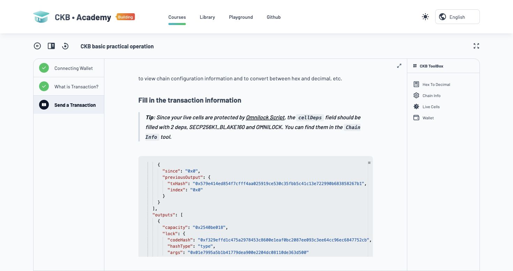
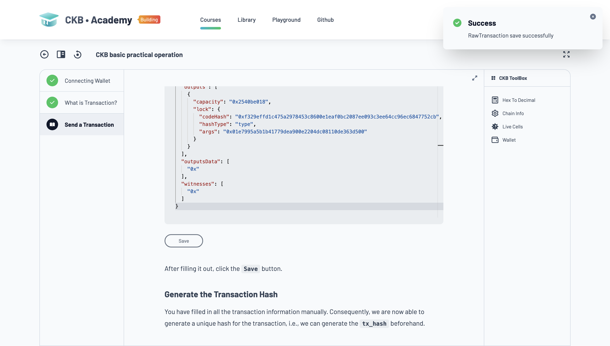
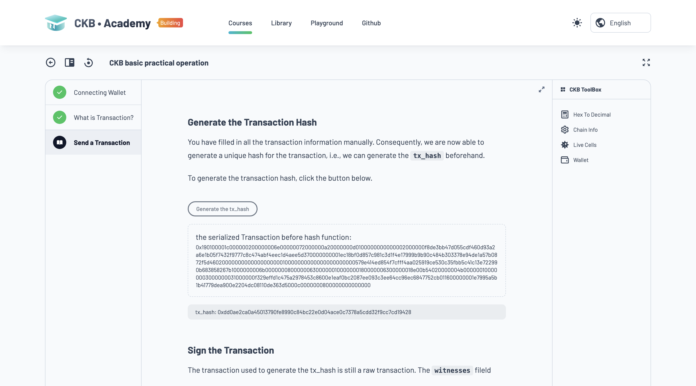
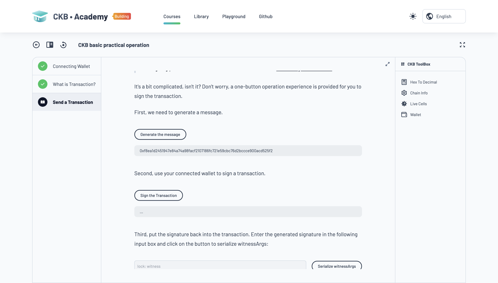
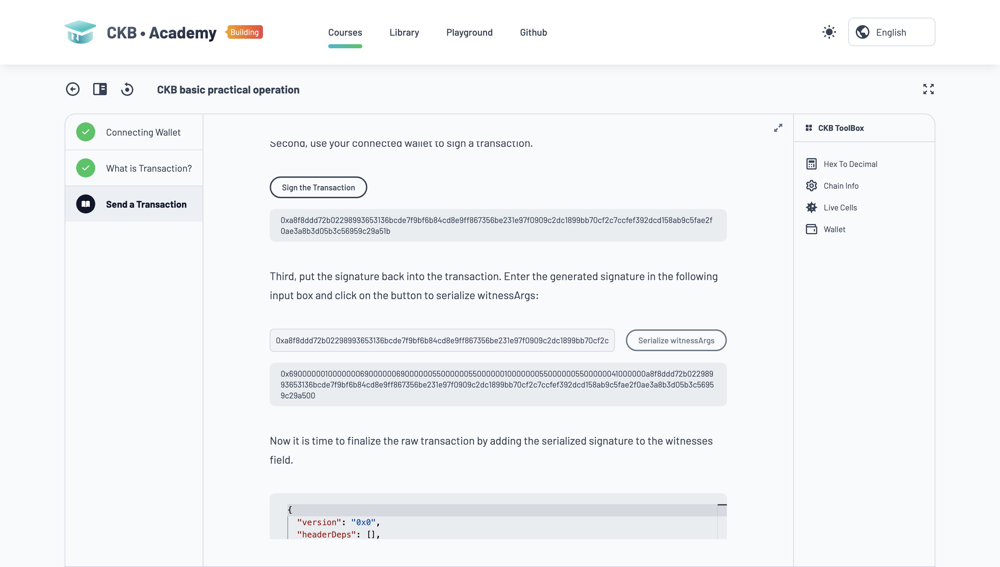
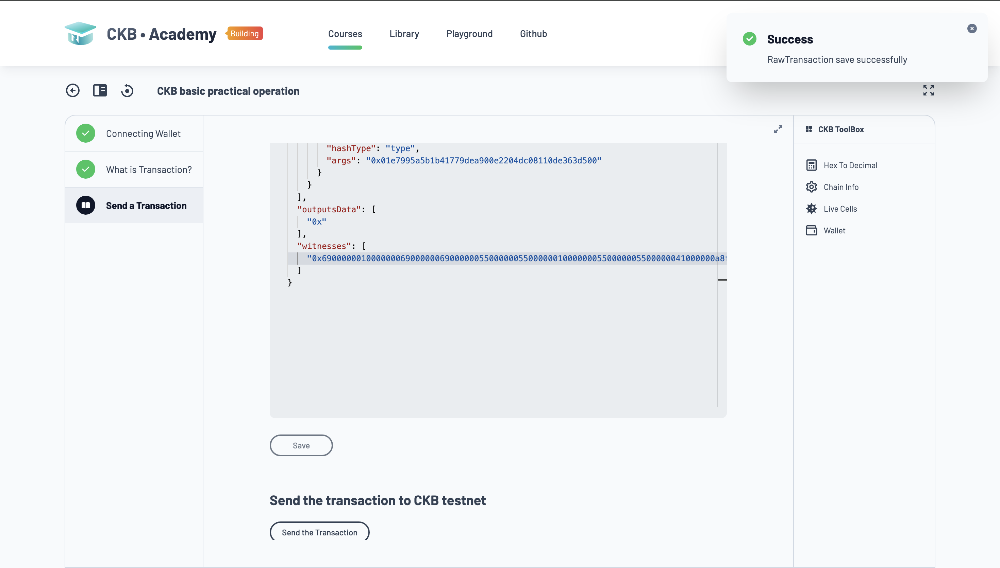
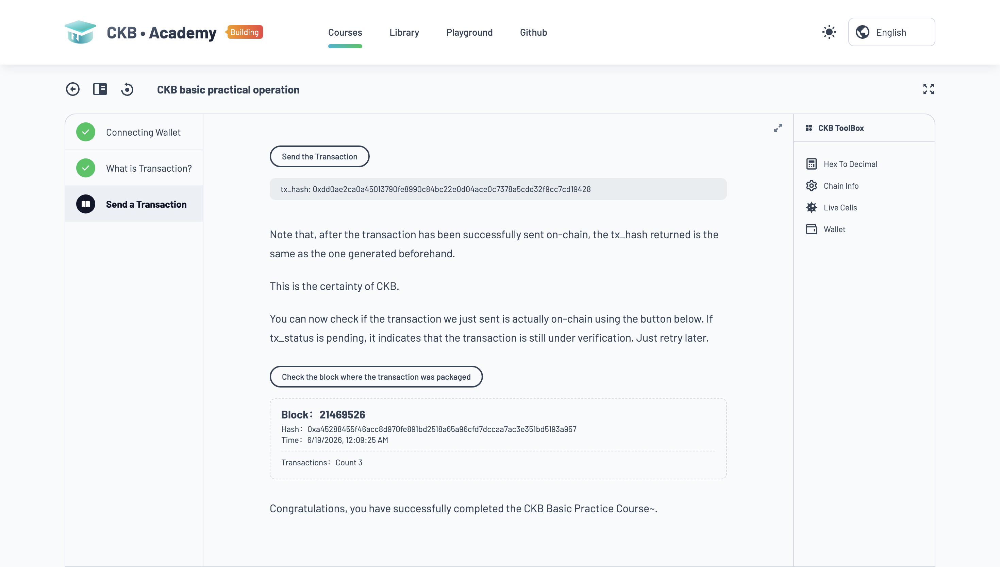

# Week 4 — CK Builder Track
Date: June 18, 2026

Summary
-------
This week was a mix of more Rustlings and finally doing the CKB basic practical operation in CKB Academy. The Rust side kept pushing me into more abstract stuff like error handling, generics, traits, and lifetimes, and on the CKB side I started seeing the cell model more concretely through the transaction exercise.

What I completed
-----------------
- Rustlings exercises:
  - `quiz2`
  - `12_options`
  - `13_error_handling`
  - `14_generics`
  - `15_traits`
  - `16_lifetimes`
- CKB Academy:
  - Completed the `CKB basic practical operation` course
  - Worked through the manual transaction exercise on the above course

Key learnings
-------------
- A cell is like a box on-chain.
- Its capacity is how much CKB is inside that box.
- A lock script(bring your own cryptography 😅) is the rule for who can open the box later.
- A transaction destroys old boxes (inputs) and creates new boxes (outputs).
- `cellDeps` are references to the script code the chain needs in order to check the rules.
- `witnesses` are the actual signature that satisfies those rules
- Omnilock confused me at first ngl, then I realised it's just a flexible lock script and probably it's why I'm able to use metamask for the exercise I think
- Lifetimes are ... interesting

Screenshots:

