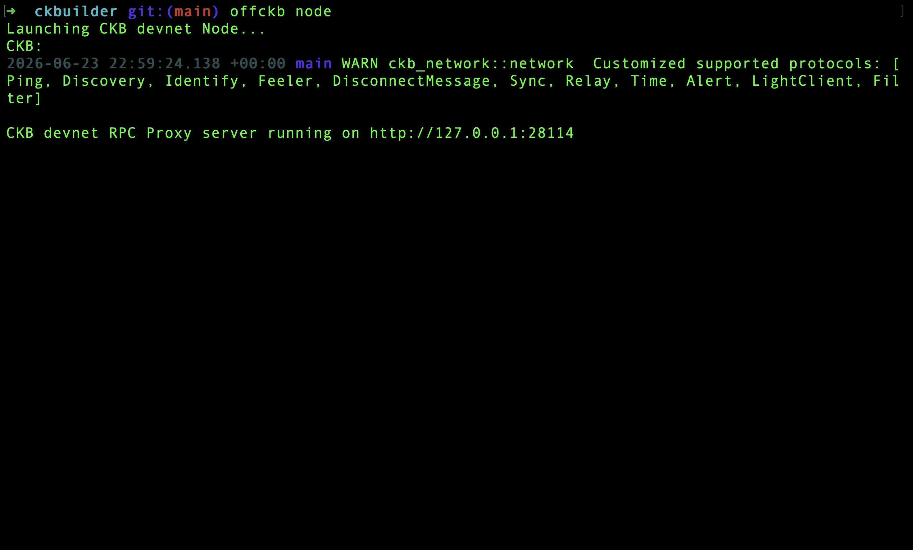
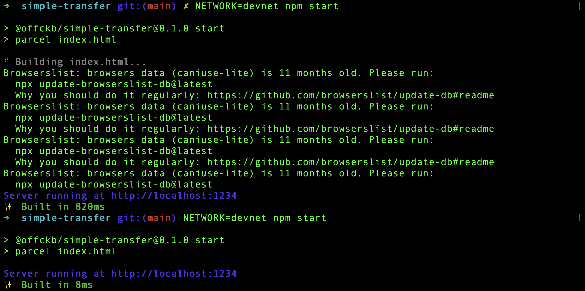
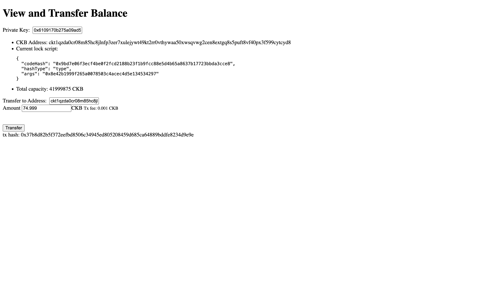
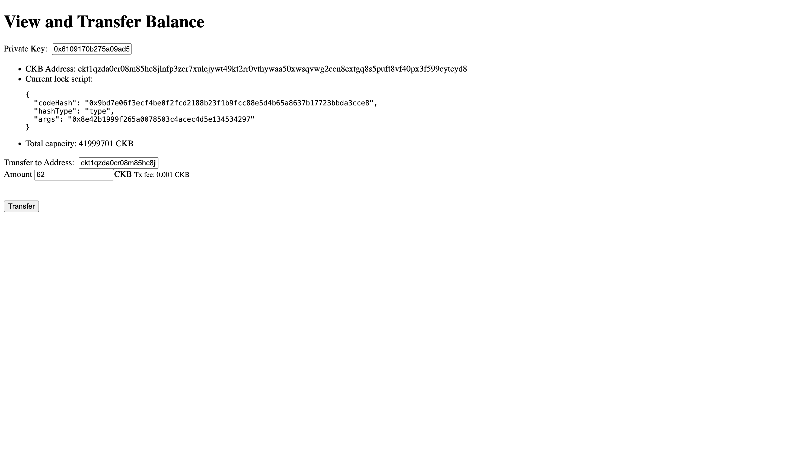

# Week 5 — CK Builder Track
Date: June 25, 2026

Summary
-------
This week was mostly me actually building with CKB instead of just reading about cells. I completed the Nervos docs [Transfer CKB dApp tutorial](https://docs.nervos.org/docs/dapp/transfer-ckb), got the simple transfer app running, sent some testnet CKB, and then immediately went "damn I gotta read the ccc docs" because ccc is clearly used for basically everything.

Also, this is the viem of the ckb world, and I LOVE viem so maybe I'll love ccc too.

What I completed
-----------------
- Completed the Nervos docs [Transfer CKB](https://docs.nervos.org/docs/dapp/transfer-ckb) dApp tutorial.
- Downloaded the `examples/` folder from the Nervos docs, started the node, then started the `simple-transfer` app.
- Sent CKB through the simple transfer app and checked the before/after state.
- Read through the CCC core concept docs:
  - [Cell Model](https://docs.ckbccc.com/en/docs/concepts/cell-model)
  - [Signer](https://docs.ckbccc.com/en/docs/concepts/signer)
  - [Transaction](https://docs.ckbccc.com/en/docs/concepts/transaction)
  - [Client](https://docs.ckbccc.com/en/docs/concepts/client)
  - [Address](https://docs.ckbccc.com/en/docs/concepts/address)

Key learnings
-------------
- `ccc` is used for basically everything in the dApp tutorial.
- `ckt` prefix = testnet addresses, `ckb` prefix = mainnet addresses.
- The lock script uses secp256k1, which is a familiar elliptic curve to me, but the public key from scalar multiplication is hashed down to 160 bits with `blake160`, and that hash has to match the script args.
- The transfer flow is pretty clean: build the transaction, complete inputs by capacity, complete the fee, sign, and send.

Screenshots:






Before sending funds:



After sending funds:



The ccc docs made transactions feel way less scary ngl. I really liked this:

```ts
import { ccc } from "@ckb-ccc/ccc";

const tx = ccc.Transaction.from({
  outputs: [
    {
      lock: recipientLockScript,
      capacity: ccc.fixedPointFrom("100"), // 100 CKB
    },
  ],
});
```

Interesting that the recipient is a lockscript. Makes sense since txs are just pacmans eating up cells and creating new cells and those who "own" the cell are the ones who can use the funds in the output.

Also ccc makes writing transactions way easier; no need to add inputs manually since there's a method called `completeInputsByCapacity`. That feels like the exact kind of abstraction I want while I'm still getting used to the cell model.


The signer docs were also pretty interesting because damn, ccc has support for so many signers SO I could definitely use privy for ckb 😏

On addresses, I think I'm finally starting to understand why the address is derived from the lock script. My first instinct was still "why not obtain it from public key hash" then I remembered not every script is an elliptic curve like I'm used to, but all cells have lock scripts so it's a pretty universal way to represent recipients. you'd think i'd have gotten used to this by now 😭😭

