# Week 6 — CK Builder Track
Date: July 3, 2026

Summary
-------
This week was me getting much deeper into what building on CKB actually feels like. I completed the Nervos docs [Store Data on Cell](https://docs.nervos.org/docs/dapp/store-data), [Create a Fungible Token](https://docs.nervos.org/docs/dapp/create-token), and [Create a DOB](https://docs.nervos.org/docs/dapp/create-dob), then also finished more Rustlings with iterators, smart pointers, and threads.

The xUDT one is the practical that really stuck with me though because wow, CKB is extremely explicit. If a transaction consumes an xUDT cell and the developer forgets to create a new output for the remainder, that remainder does not just stay with the sender automatically. It is just gone lol. That genuinely messed with my head coming from ERC20 brain.

What I completed
-----------------
- Completed the Nervos docs [Store Data on Cell](https://docs.nervos.org/docs/dapp/store-data) example.
- Wrote and read data from a cell using the example app.
- Completed the Nervos docs [Create a Fungible Token](https://docs.nervos.org/docs/dapp/create-token) example.
- Issued a token, inspected the token cell, and transferred part of the balance.
- Completed the Nervos docs [Create a DOB](https://docs.nervos.org/docs/dapp/create-dob) example.
- Finished Rustlings `18_iterators`, `19_smart_pointers`, and `20_threads`.

Key learnings
-------------
- The xUDT example was the one that messed with my head a bit. When an xUDT cell gets consumed, any remaining amount has to be explicitly recreated in a fresh output cell back to the sender. If that output is missing, the leftover tokens do not magically remain in your balance somewhere. They are just not there anymore. A dev leaves that output from the transaction and tokens are burned 😭🔥🔥🔥
- That made it click for me that the xUDT type script is there to validate the rules of the transaction, not to save users from a developer forgetting important logic.
- The token-specific data being tied to the xUDT args also made more sense after doing the tutorial.

Screenshots:

Starting the node for the practicals:

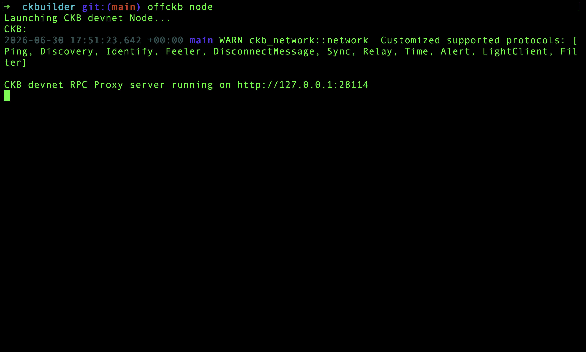

Store Data on Cell:

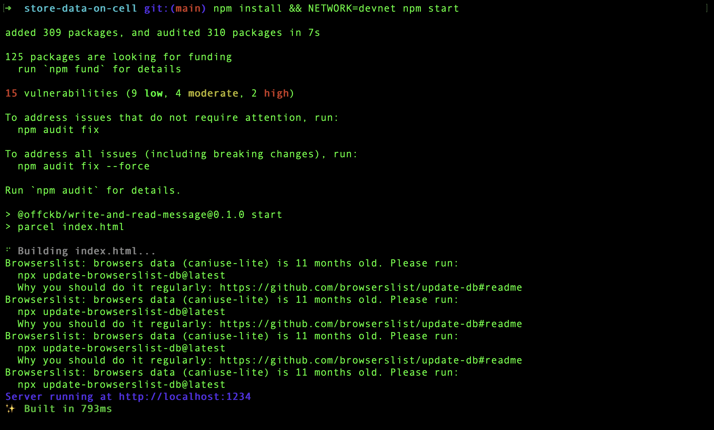

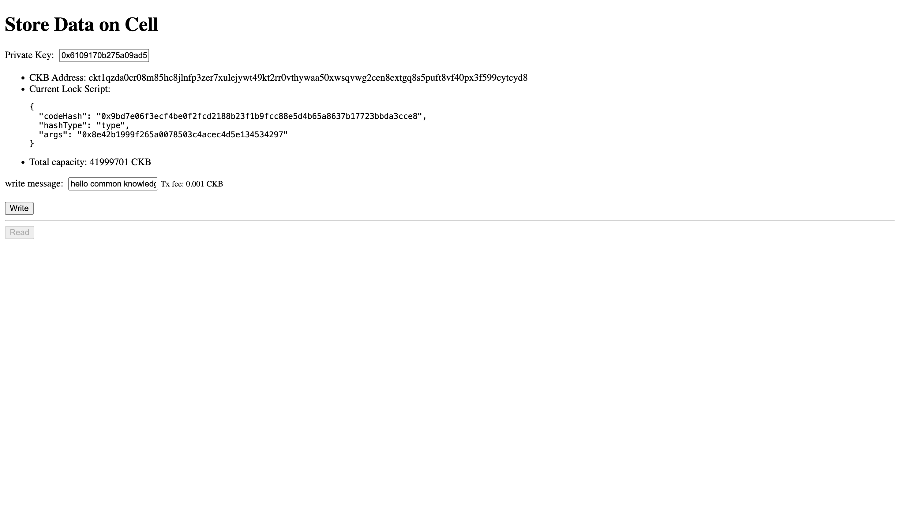

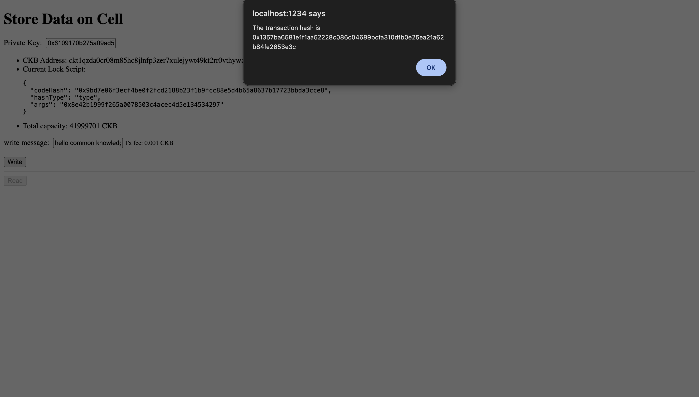

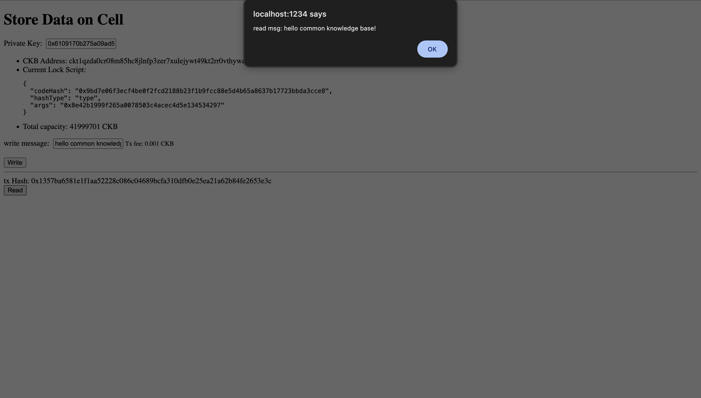

Create a Fungible Token:

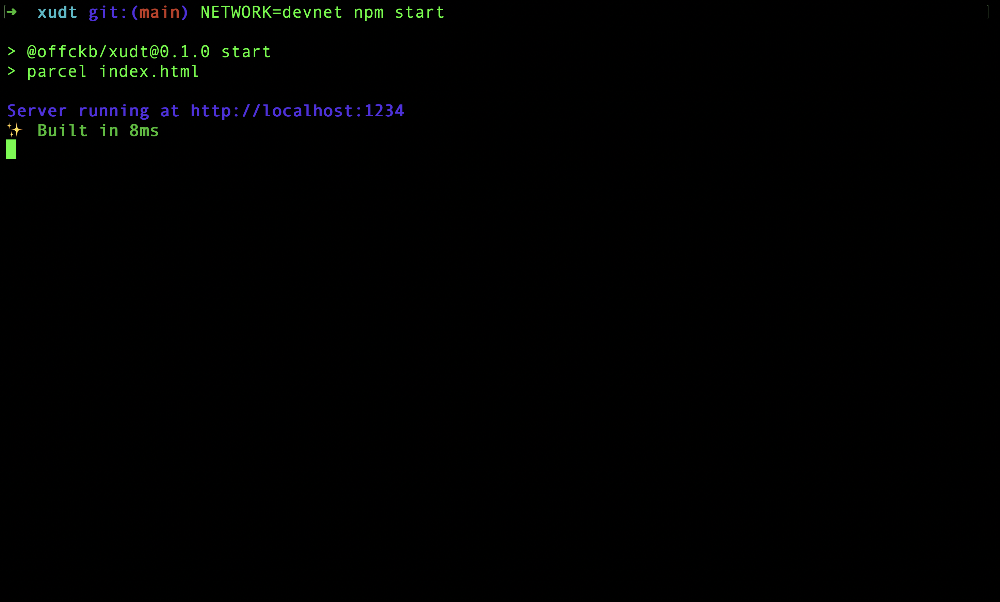

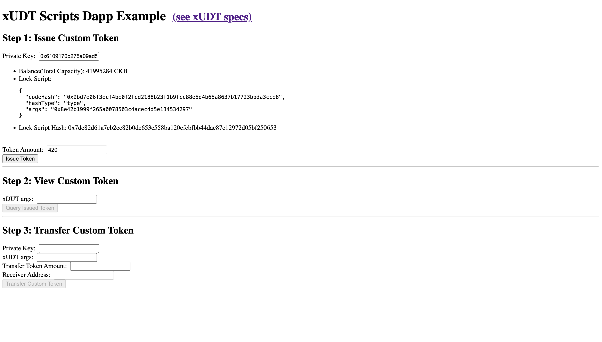

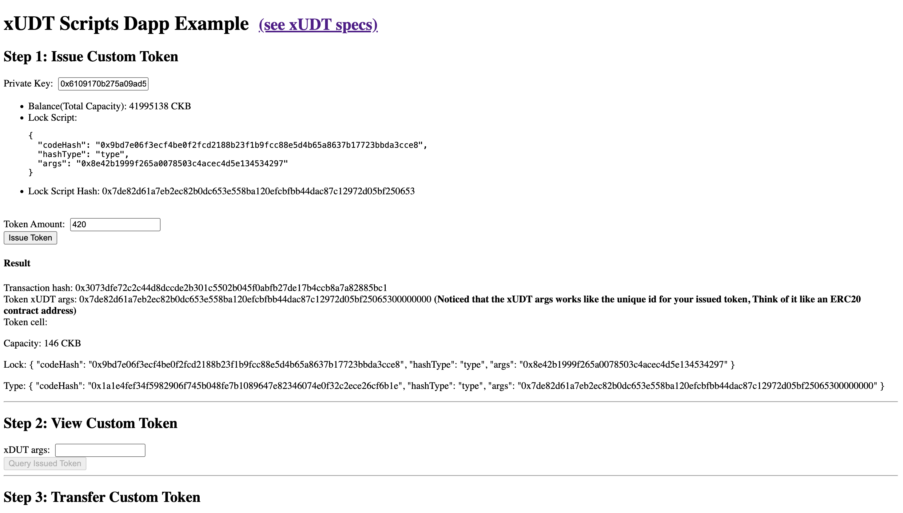

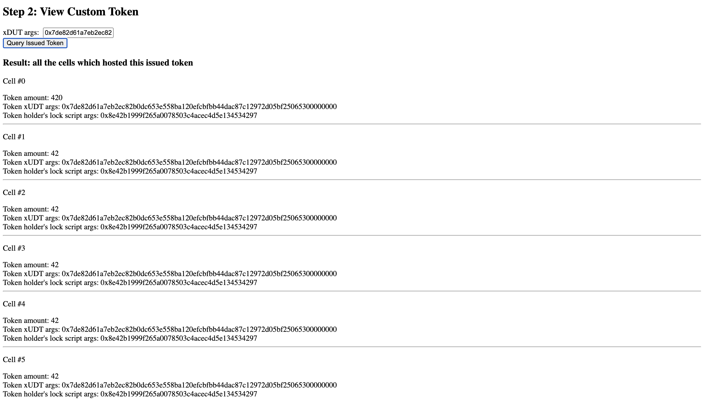

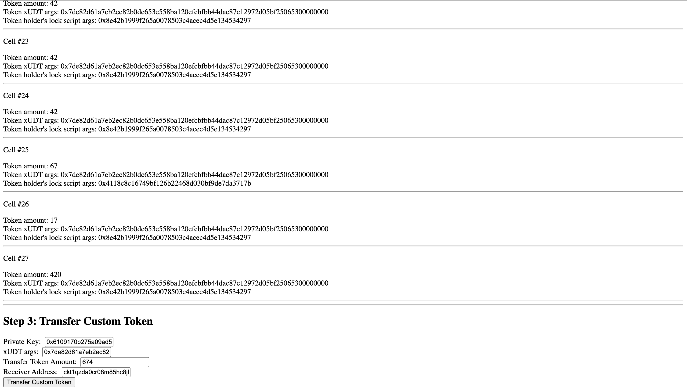

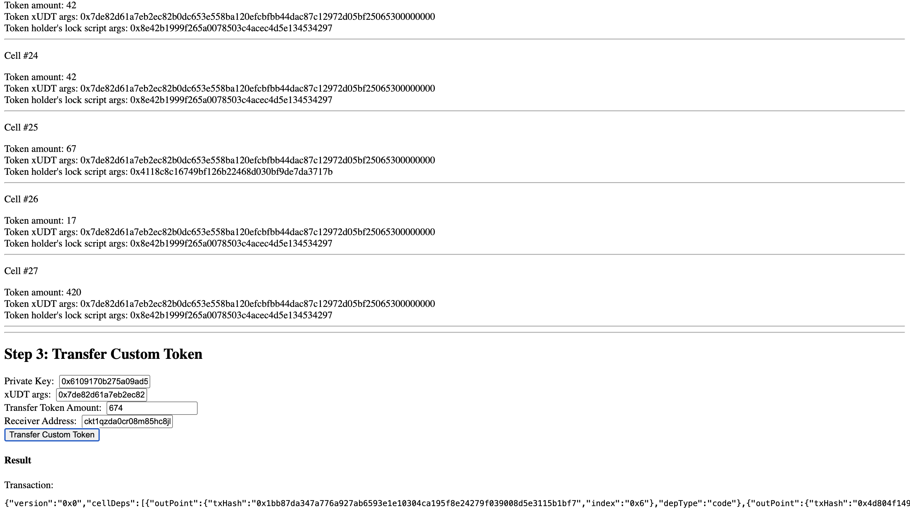

Create a DOB:

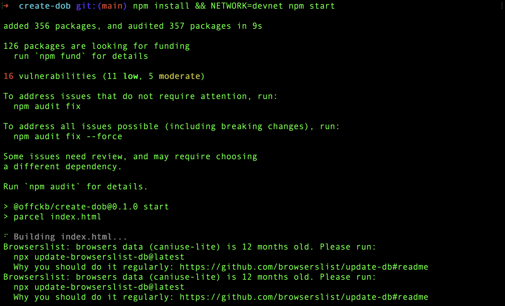

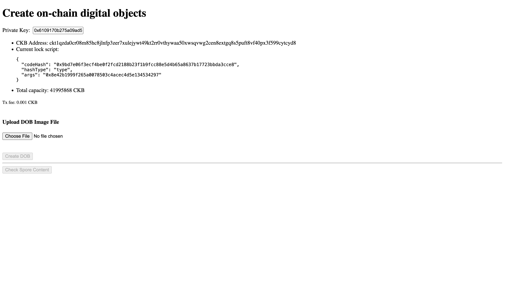

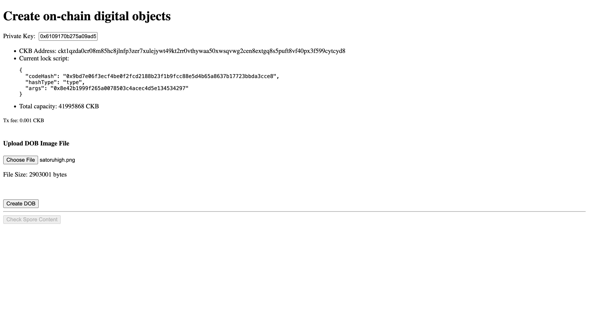

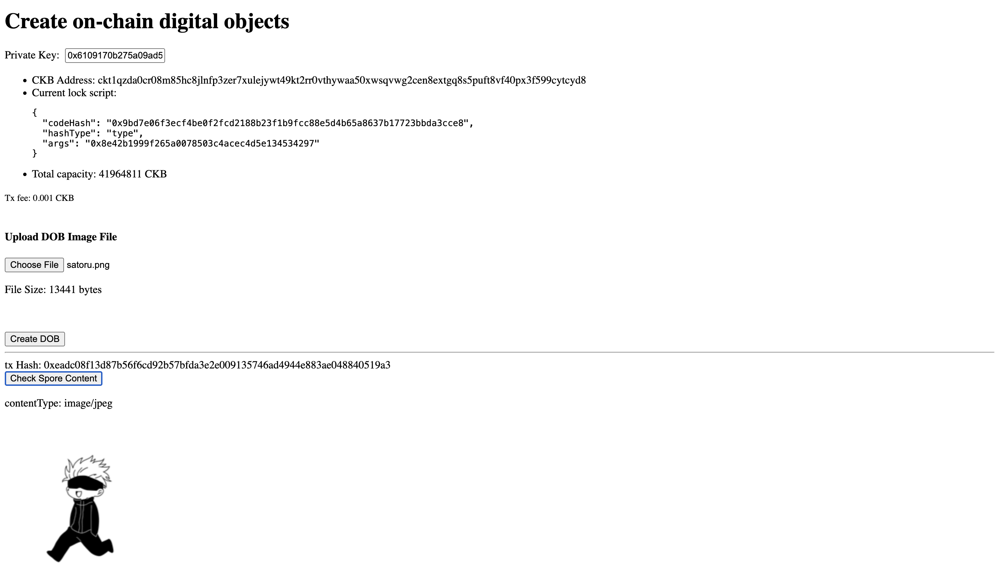

