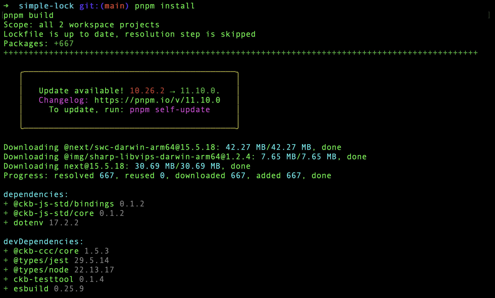
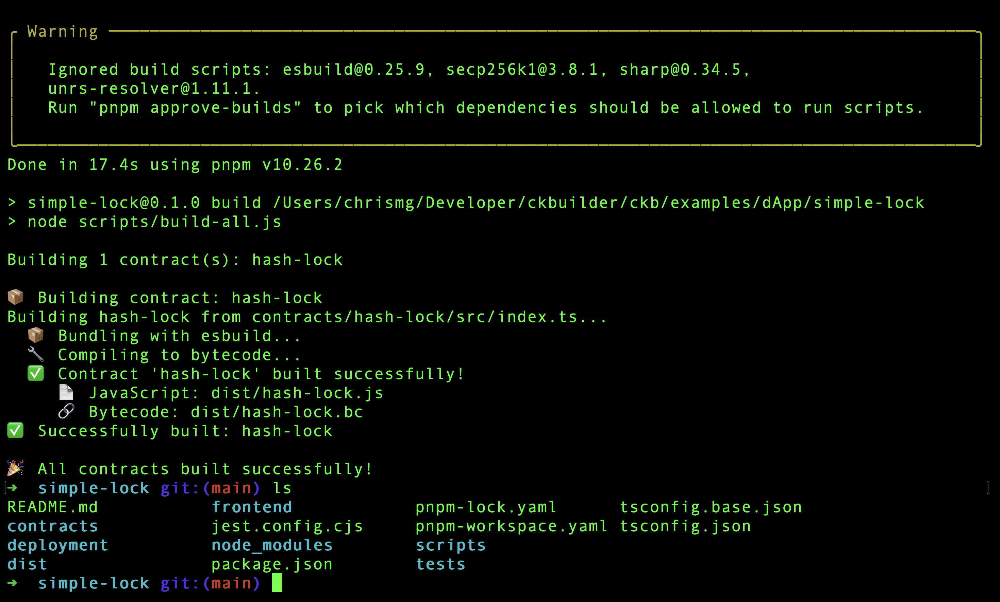
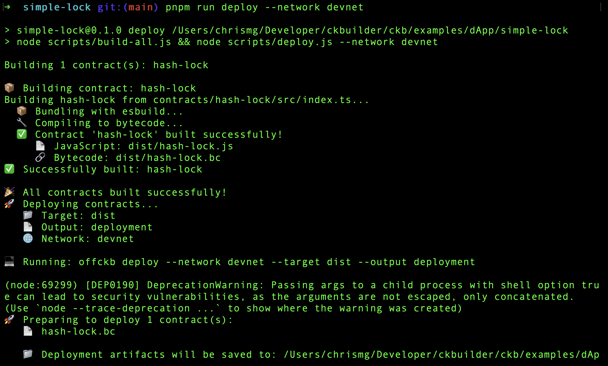
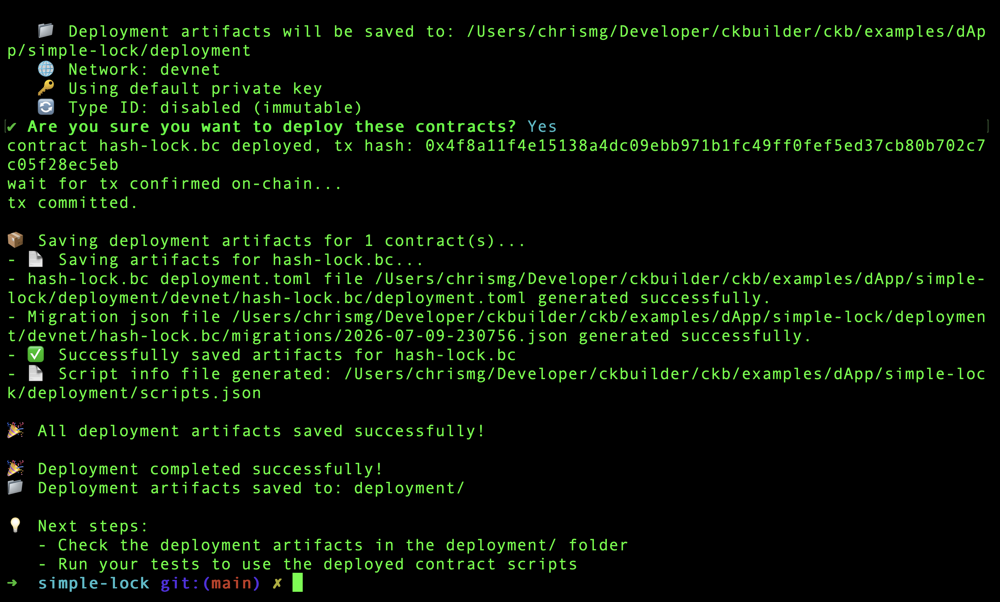
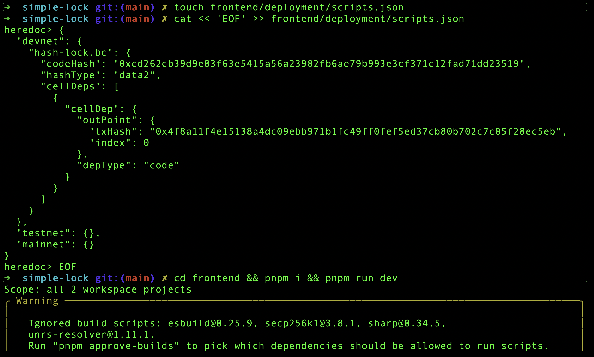
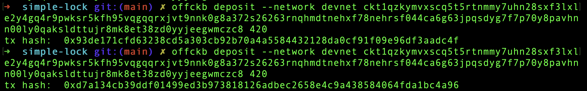
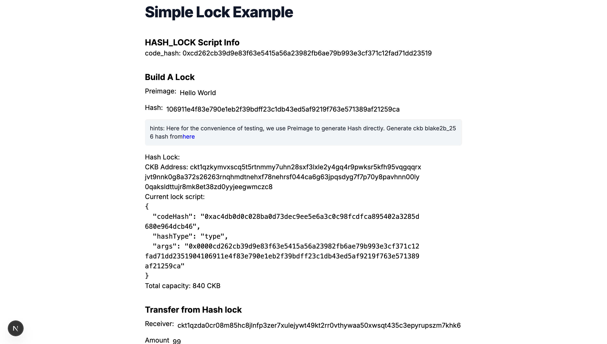
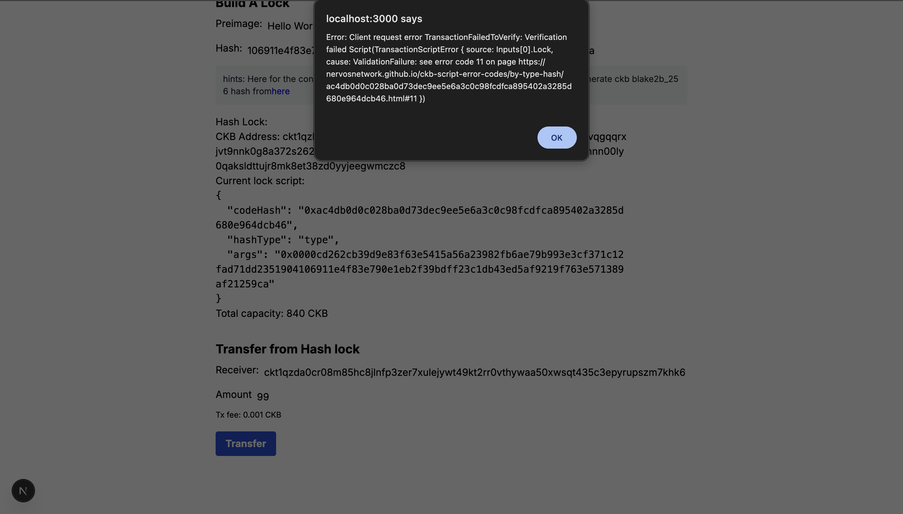
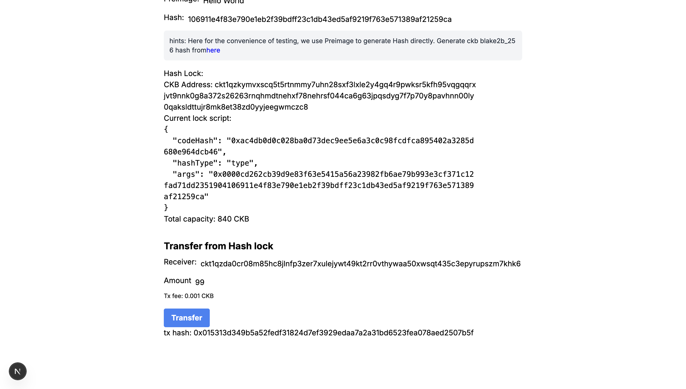

# Week 7 — CK Builder Track
Date: July 9, 2026

Summary
-------
This week I completed the Nervos docs [Build a Simple Lock](https://docs.nervos.org/docs/dapp/simple-lock) tutorial and finished the last 3 Rustlings sections too: `21_macros`, `22_clippy`, and `23_conversions`. The simple lock tutorial was actually fun because it felt like the most literal version possible of "a lock script can be anything", and seeing it accept or reject a transfer depending on the witness made the idea click for me way more.

What I completed
-----------------
- Completed the Nervos docs [Build a Simple Lock](https://docs.nervos.org/docs/dapp/simple-lock) tutorial.
- Deposited funds into the generated hash lock address and tested unlocking it through the frontend.
- Tried transferring with the wrong preimage value first, then with the correct one.
- Finished Rustlings `21_macros`, `22_clippy`, and `23_conversions`.

Key learnings
-------------
- this is what I imagined when I heard of lock scripts.
- From what I've seen in the script, it just wants something whose hash matches the script args.
- Its input comes from the transaction witness.
- Of course this one isn't production ready because rainbow tables exist lol.
- I also just realised I missed the obvious reason too: the preimage is in the witness 😭😭😭

Screenshots:

Starting the node and opening the tutorial flow:











Running the command to deposit funds:



This is the UI after depositing funds:



Me after passing in the wrong lock script value 🙂



I passed in a correct value and the lock script allowed me to transfer the CKB:



From what I've seen in the script:

```javascript
let expect_hash = new Uint8Array(HighLevel.loadScript().args).slice(35); // lock script arg

let witness_args = HighLevel.loadWitnessArgs(0, bindings.SOURCE_GROUP_INPUT);
let preimage = witness_args.lock!;

let hash = hashCkb(preimage);
```
It just wants something whose hash matches the script args
It's input comes from the transaction witness.
Basically telling the entire chain: bear witness(👀) as I reveal my secret and expose my funds