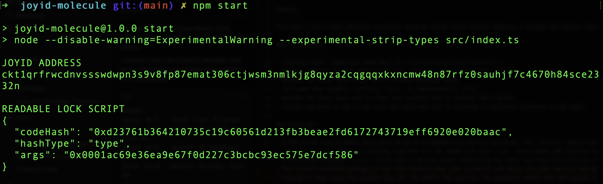
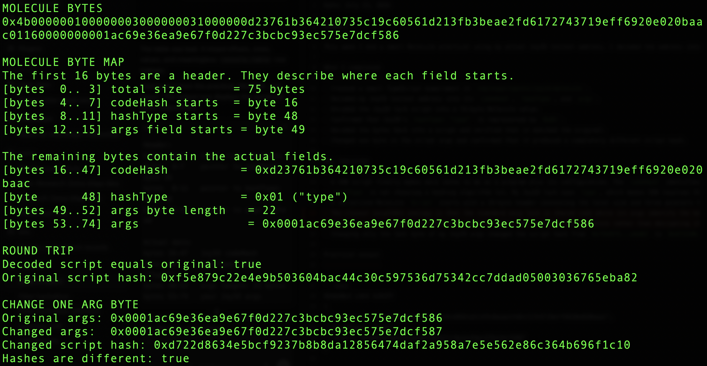

# Week 9 — CK Builder Track
Date: July 23, 2026

Summary
-------
This week I did a small Molecule practical using my actual JoyID testnet address. I decoded the address into its lock script, encoded the script into Molecule bytes, mapped the serialized byte ranges, and decoded it back into the original script. Molecule made way more sense once I could compare the readable JSON with the exact bytes CKB uses.

What I completed
-----------------
- Created a small TypeScript experiment in `ckb/experiments/joyid-molecule`.
- Decoded my JoyID testnet address into its `codeHash`, `hashType`, and `args`.
- Encoded the JoyID lock script into a 75-byte Molecule value.
- Confirmed that JoyID's `hashType: "type"` is represented by `0x01`.
- Decoded the bytes back into a script and verified that it matched the original.
- Changed one byte in the script args and confirmed that it produced a completely different script hash.

Key learnings
-------------
- A CKB script finally makes more sense to me as a program plus its configuration. The `codeHash` identifies the lock program, `hashType` tells CKB how to resolve that program, and `args` configure that program for a particular cell or account.
- `hashType` is not choosing a hashing algorithm lol. My JoyID lock uses `type`, which means CKB resolves the code through the type-script identity of its dependency cell. Molecule encodes that value as `0x01`.
- A serialized Molecule `Script` starts with a 16-byte header containing the total size and three pointers to its fields. The actual `codeHash` occupied bytes 16–47, `hashType` was byte 48, and the args field occupied the remaining bytes.
- Changing only the last byte of my JoyID args changed the script hash from `0xf5e879...eba82` to `0xd722d8...f1c10`. The lock code stayed the same, but it was now a different configured lock identity.

Practical output
----------------

```text
READABLE LOCK SCRIPT
{
  "codeHash": "0xd23761b364210735c19c60561d213fb3beae2fd6172743719eff6920e020baac",
  "hashType": "type",
  "args": "0x0001ac69e36ea9e67f0d227c3bcbc93ec575e7dcf586"
}

MOLECULE BYTE MAP
Header:
bytes  0–3    total size: 75 bytes
bytes  4–7    pointer to codeHash: byte 16
bytes  8–11   pointer to hashType: byte 48
bytes 12–15   pointer to args field: byte 49

Actual fields:
bytes 16–47   JoyID codeHash
byte  48      hashType: 0x01 ("type")
bytes 49–52   args length: 22 bytes
bytes 53–74   my JoyID args

Decoded script equals original: true
Hashes are different after changing one arg byte: true
```

